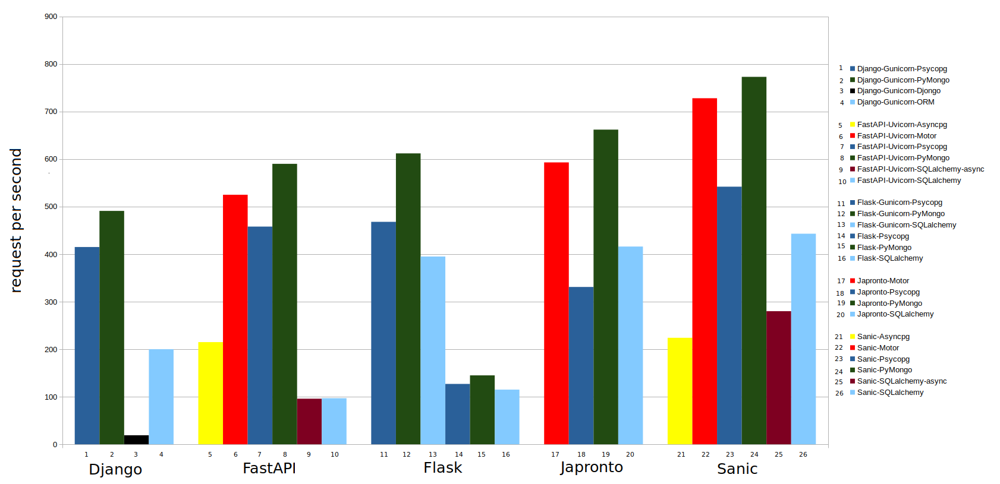

# Python Web Application Framework Load Test

### Project Description

This project provides performance tests across some famous Python web application frameworks. The test criterion is receiving the list of records from the database(MongoDB and PostgreSQL) through REST API. You can find [data](https://github.com/dr5hn/countries-states-cities-database) in the directory ```/data``` and load them to the database. Here is the list of frameworks:

- Django
- FastAPI
- Flask
- Japronto
- Sanic

### Load Testing Tool

For each test, Apache Bench sends 5000 requests in batches of 100 concurrent by the following command.

```bash
ab -n 5000 -c 100 http://127.0.0.1:8000/countries/
```

### Result

The final document of each test is saved in the ```/result``` directory. The results may vary on different systems.



<html>
    <div style="display:flex;margin:5px"><div style="width:10px;height:10px;background-color:#2A6099;margin:5px"></div><span>Psycopg</span></div>
    <div style="display:flex;margin:5px"><div style="width:10px;height:10px;background-color:#224B12;margin:5px"></div><span>PyMongo</span></div>
    <div style="display:flex;margin:5px"><div style="width:10px;height:10px;background-color:#000000;margin:5px"></div><span>Djongo</span></div>
    <div style="display:flex;margin:5px"><div style="width:10px;height:10px;background-color:#83CAFF;margin:5px"></div><span>ORM</span></div>
    <div style="display:flex;margin:5px"><div style="width:10px;height:10px;background-color:#FFFF00;margin:5px"></div><span>Asyncpg</span></div>
    <div style="display:flex;margin:5px"><div style="width:10px;height:10px;background-color:#FF0000;margin:5px"></div><span>Motor</span></div>
    <div style="display:flex;margin:5px"><div style="width:10px;height:10px;background-color:#7E0021;margin:5px"></div><span>SQLalchemy-async</span></div>
</html>

Follow [link](https://medium.com/@amirayat20/which-python-web-framework-wins-over-the-others-9b7ca32e783c) to read more.


